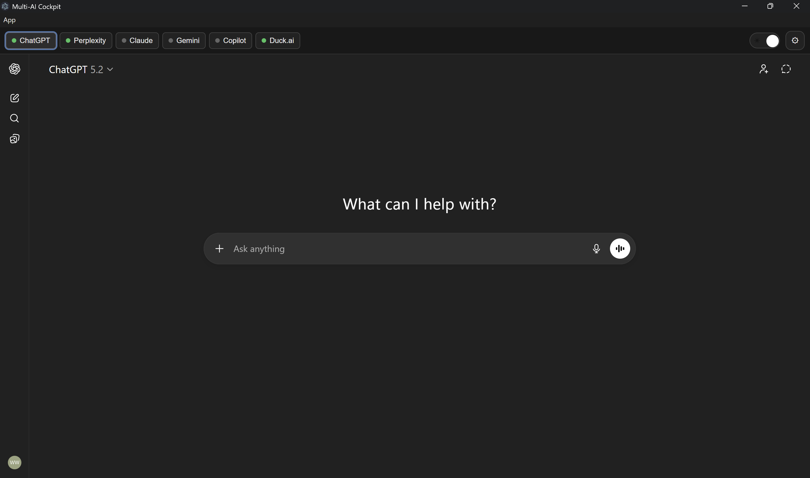

## Downloads

[](https://github.com/Mjarzyk/Multi-AI-Wrapper/releases/download/v1.0.0/MultiAICockpit-win32-x64-v1.0.0.zip)
[](https://github.com/Mjarzyk/Multi-AI-Wrapper/releases/download/v1.0.0/MultiAICockpit-macOS-universal-v1.0.0.zip)

---

## Platform Notes (macOS)

**Passkeys / Touch ID:**  
macOS builds of the app currently cannot use system passkeys or Touch ID inside the embedded browser.  
If your account uses a passkey for login, open the service once in Safari or Chrome to complete the sign-in, then return to the app.

**Gemini sign-in / message errors:**  
Gemini may show “something went wrong” or fail to send messages on macOS when used inside the wrapper.  
This is due to Electron’s WebView limitations on macOS.  
Signing into Gemini in Safari first generally resolves the issue.

---

# Multi-AI Wrapper

Multi-AI Wrapper is a lightweight Electron desktop app that puts multiple AI assistants into a single window with simple tabs.

Supported services:

- ChatGPT
- Claude
- Copilot
- Gemini
- Perplexity

> Built collaboratively with the help of AI tools.

---

## Screenshot



---

## What it does

- **Unified UI** – One app window with tabs for each AI.
- **Lazy preloading** – Each service loads the first time you click its tab, then stays resident so switching back is fast.
- **No API keys required** – It just wraps the existing web apps for each service.

---

## How to use (normal users)

You do **not** need Node.js, npm, or any dev tools to use this app.

### Windows

1. Download the Windows build ZIP.
   - This may come from GitHub Releases or directly from the author.
2. Unzip it somewhere convenient.
3. Inside the unzipped folder, run:

   `MultiAICockpit.exe`

4. The app will open with a top tab bar:
   - ChatGPT, Claude, Copilot, Gemini, Perplexity

Click any tab, sign in to that service inside the window if needed, and start using it.

You can pin `MultiAICockpit.exe` to the Start menu or taskbar for quick access.

---

### macOS

1. Download the macOS build ZIP.
   - This is typically produced by GitHub Actions and shared with testers.
2. Unzip it. Inside you’ll see a folder:

   `MultiAICockpit-darwin-universal/`

3. Inside that folder, run:

   `MultiAICockpit.app`

4. On first launch, macOS Gatekeeper may say the app is from an unidentified developer:
   - Right-click `MultiAICockpit.app`
   - Choose **Open**
   - Confirm the dialog

After the first time, you can open it normally with a double-click.

---

## How it works (high level)

- The top bar (tabs) is a simple HTML/JS UI.
- Each provider runs in its own Electron `BrowserView`:
  - ChatGPT – `https://chatgpt.com/`
  - Claude – `https://claude.ai/`
  - Copilot – `https://copilot.microsoft.com/`
  - Gemini – `https://gemini.google.com/app`
  - Perplexity – `https://www.perplexity.ai/`
- Views are created lazily the first time you click each tab, then reused for instant switching.

You sign in inside each tab just like you would in a normal browser.

---

## For developers / contributors

If you want to modify or build the app yourself, you’ll need:

- Node.js 20+
- npm
- Git

### Clone and install

```bash
git clone https://github.com/Mjarzyk/Multi-AI-Wrapper.git
cd Multi-AI-Wrapper
npm install
```

### Run in development

```bash
npm start
```

### Package a Windows build (from Windows)

```bash
npm run package-win
```

The packaged app will be in:

```
dist/MultiAICockpit-win32-x64/
```

The `MultiAICockpit.exe` in that folder is what you distribute to Windows users (along with the rest of the folder).

### Package a macOS build (from macOS or CI)

```bash
npm run package-mac
```

On macOS or GitHub Actions, this creates:

```
dist/MultiAICockpit-darwin-universal/
```


The `MultiAICockpit.app` inside that folder is the macOS app.

### Status

This is an early, experimental tool intended for personal use and tinkering. Expect rough edges.

### Planned improvements

- ~~Prebuilt releases for Windows and macOS attached to GitHub Releases~~
- Keyboard shortcuts for tab switching (e.g. Ctrl+1 / Cmd+1)
- Unified Search Across Tabs: Let users type a query once and broadcast it to all tabs
- Customizable Themes: Dark/light modes, plus user-defined color schemes for each AI tab
- Pinned Tabs / Favorites: Allow users to reorder or pin their most-used AI assistants
- Note-Taking Sidebar: A lightweight markdown editor alongside AI tabs for jotting down insights
- Export Options: One-click export of selected AI responses to Markdown, PDF, or plain text
- Cross-AI Comparison Mode: A split-screen or grid view showing multiple assistants’ answers simultaneously
- Offline Caching: Cache recent conversations locally for quick access even without internet
- Resource Monitoring: Show memory/CPU usage per tab to help users manage heavy sessions

