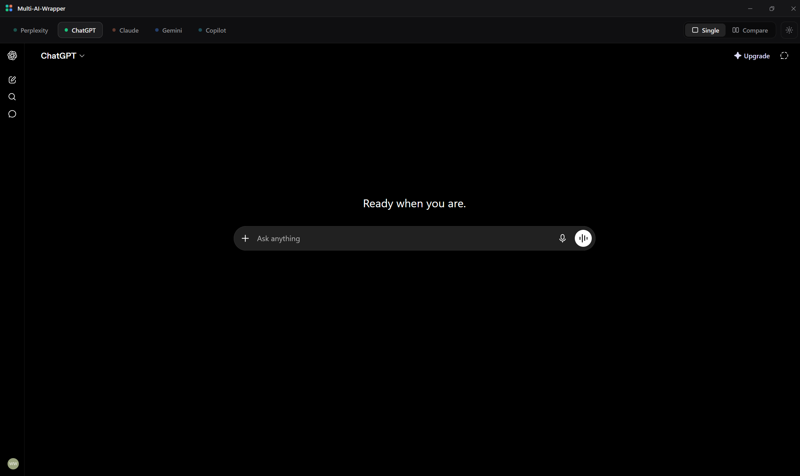
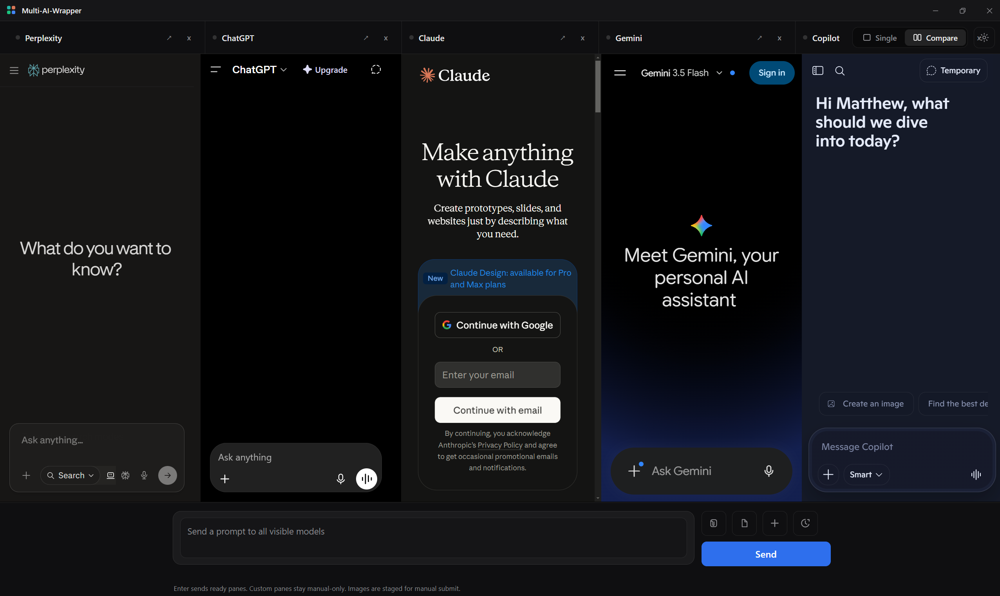

# Multi-AI-Wrapper

Multi-AI-Wrapper keeps multiple AI web apps in one Electron window. It supports a normal single-chat tab view and a side-by-side compare view.

Supported services:

- ChatGPT
- Claude
- Copilot
- Gemini
- Perplexity
- Custom HTTPS tabs

## Downloads

## Screenshots

### Single chat view

### Compare view

## Current features

- Single-view tabs for built-in providers and custom HTTPS tabs
- Compare view with side-by-side panes in the same order as the main tab bar
- Shared compare composer for sending one prompt to every visible pane
- Shared prompt history
- Compare image staging: attach in the wrapper, stage into each provider pane, then submit manually in the provider panes
- Keyboard shortcuts for reload, stop, settings, compare mode, prompt history, and tab switching
- Settings pages for models, compare view, behavior, appearance, and GitHub links
- Top-bar status indicators for unloaded, ready, loading, and error states
- Lazy loading so providers open on first use and stay resident after that

## How to use

No API keys are required. Sign in to each provider inside the app.

### Windows

1. Download the latest Windows release.
2. Extract the ZIP.
3. Run `Multi-AI-Wrapper-v<version>.exe` inside the extracted folder.

### macOS

1. Download the latest macOS release.
2. Extract the ZIP.
3. Open `Multi-AI-Wrapper-v<version>.app`.
4. If Gatekeeper blocks the first launch, right-click the app and choose **Open**.

### Linux

1. Download the latest Linux release.
2. Extract the archive.
3. Run the `Multi-AI-Wrapper-v<version>` binary from the extracted folder.

## Platform notes

### macOS

**Passkeys / Touch ID**  
Electron does not expose macOS system passkeys or Touch ID cleanly inside these embedded provider windows. If your login flow depends on a passkey, finish sign-in once in Safari or Chrome and then return to the app.

**Gemini sign-in / message errors**  
Gemini can still misbehave inside Electron on macOS. If Gemini fails to sign in or send, complete sign-in once in Safari first and then retry in the app.

## How it works

- The wrapper UI is standard HTML, CSS, and JavaScript.
- Each provider runs in its own Electron `BrowserView`.
- Views are created on first use and reused after that.
- Compare mode lays the provider views out side by side and uses the wrapper composer to stage shared prompts.

Provider URLs:

- ChatGPT: `https://chatgpt.com/`
- Claude: `https://claude.ai/`
- Copilot: `https://copilot.microsoft.com/`
- Gemini: `https://gemini.google.com/app`
- Perplexity: `https://www.perplexity.ai/`

## Status

Usable. Still being cleaned up.

## Planned improvements

- ~~Prebuilt releases for Windows, Linux, and macOS attached to GitHub Releases~~
- ~~Keyboard shortcuts for tab switching, compare mode, prompt history, reload, stop, and settings~~
- ~~Allow users to reorder the AI assistants and persist tab order after relaunch~~
- ~~Spellcheck support for text inputs~~
- ~~Tab status indicators for unloaded, ready, loading, and error states~~
- ~~Dark/light theme setting~~
- ~~Settings panel for appearance, behavior, models, compare view, and About links~~
- ~~User add/remove tabs and custom embedded URLs~~
- Compare view presets for named pane sets such as `All`, `Research`, or `Coding`
- Compare header actions for hiding panes without opening Settings
- ~~Compare view persistence across relaunches and model changes~~
- ~~Shared prompt history for the compare composer~~
- ~~Settings split between model management and compare view~~
- Image and file handling beyond the current staged image workflow
- Visual cleanup across the header, tabs, compare controls, and Settings
- Command palette (`Ctrl+K` / `Cmd+K`)
- Export options for notes or app-owned content

## Future improvements

- Response alignment tools for side-by-side review and summary output
